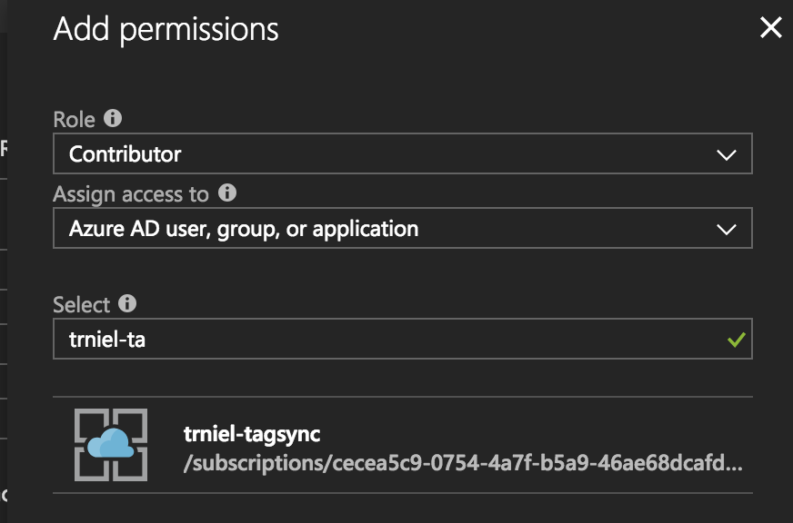
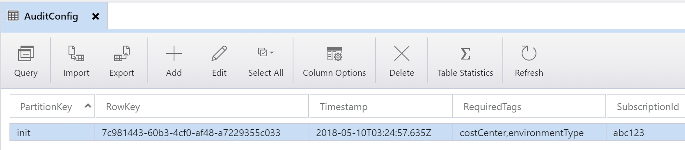
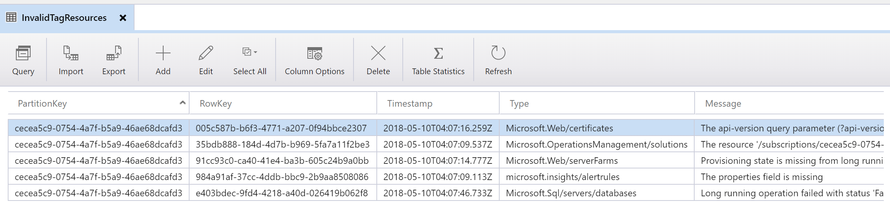
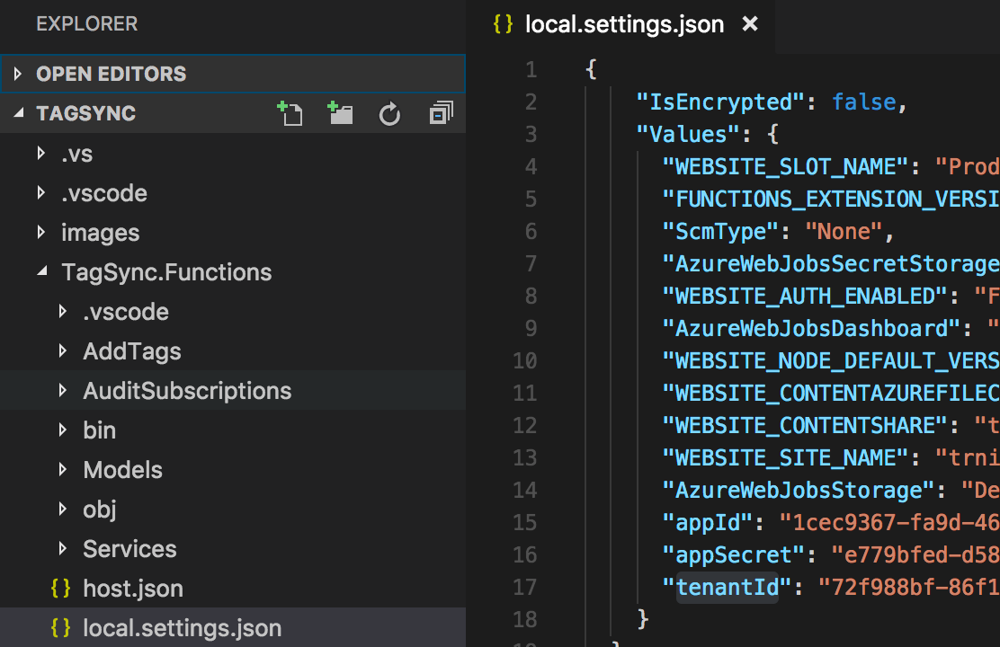

# Automated Tag Synchronization for Azure Resources

This is a proof-of-concept application that synchronizes mandatory tags set on Resource Groups to the resources they contain. Synchronization happens automatically based on a user-defined schedule. The application is broken down into two Functions:

- **AuditResourceGroups:** Executes on a user-defined schedule and reads in subscription configuration data from an Azure Storage table. This configuration includes a list of tags that a given resource group in that subscription must implement. The function iterates through each resource group, inspects the tag values, and determines if changes are required (new or modify) on resources. If so, a message is added to a queue with the details required to add / modify the tag(s) for that resource.

- **AddTags:** Processes each message added to the queue by the AuditResourceGroups function and modifies the tags as necessary. If there are any issues with the tagging, an error is logged and any future resource of that type is exempted from future audits.

## Deployment

### Create and configure the Function App

In the Azure Portal, create a new Function App by navigating to App Services and selecting the **Add** button in the upper left. In the Marketplace section, select *Function App*. In the create dialogue, enter the desired name, resource group, and storage account. Be sure to keep Windows as the OS type. It is recommended (but not required) to enable the *Application Insights* option.

Once the Function App is created, a few follow-up configurations are necessary:

#### Upgrade function runtime

In the Azure Portal, navigate to the Function App and select *Function App Settings*. Switch the runtime version to **beta**.

### Set the Node.js version

Navigate to **Platform Features** > **App Settings** and create a new setting: ```WEBSITE_NODE_DEFAULT_VERSION``` and set the value to ```8.11.1```.

#### Enable Managed Service Identity (MSI)

This application makes use of Managed Service Identity for authenticated access to your subscriptions. This is a great security feature that removes the burden of credential management for services running in Azure. Enable MSI by navigating to **Platform features** and selecting **Managed Service Identity**. At the next screen, toggle **Register with Azure Active Directory** to **On** and click **Save**.

Next, you must assign the application permissions to each subscription you wish to enable for tag synchronization. This is achieved in the Azure Portal by using the search bar and entering **Subscriptions**. Click the suggested link and select a subscription displayed on the next page. In the settings blade, select **Access Control (IAM)** and click the **Add** button. On the Add Permissions blade at the right, select **Contributor** as the Role and enter the name of your function in the select bar. You should see your function app suggested as shown here:



Select the function app and click **Save**. Repeat this process for any additional subscriptions.

#### Create storage tables

Currently, two tables must be manually created within the storage account associated to the Function App before the solution can run. Use the Azure Portal or Azure Storage Explorer to create them with the following names:

- ```AuditConfig```
- ```ResourceTypes```

### Deploy the Functions

The quickest way to deploy the TagSync functions is to leverage App Service's CI/CD features with this repository as a source. From the Function App, navigate to **Platform Features** > **Code Deployment** > **Deployment Options**. In the Deployments blade, click **Setup** and select **External Repository** as the source. Enter the Git URL:

```http
https://github.com/travisnielsen/azuretagsync-js.git
```

Accept the remaining default settings. App Services will clone the repo, download dependencies, and deploy the functions to your Function App. The process typically takes a few minutes.

> NOTE: Another option is to clone or fork this repository into your own and configure the App Services CI/CD integration accordingly.

## Configuration and Operation

By default, the ```AuditResourceGroups``` function runs once every 4 hours. The ```AddTags``` function is triggered by messages placed into the ```resources-to-tag``` queue. You can manually initialize the process by clicking the Run button on ```AuditSubscriptionTags``` the portal. It is recommended to do this once after the deployment has been completed so that the columns for the ```AuditConfigTable``` are created.

When in operation, the solution works by interacting with the following tables hosted in the Storage Account.

### AuditConfig

For each subscription you wish to audit, you must define a configuration item for it in the AuditConfig table. Configuration currently consists of two columns.

- ```SubscriptionId```: The GUID (ID) that represents the subscription.
- ```RequiredTags```: A comma separated list of tags that must be synchronized from the resource group to the resource item.

Once configuration is completed, your table should look like the following:



### AuditStats

 Information about every subscription audit performed by ```AuditSubscriptionTags``` is recorded in this table.

 > NOTE: AuditStats is currently not implemented in the JavaScript version of TagSync

### ResourceTypes

Azure does not currently have a unified API for resource tagging. There are cases where exceptions will be thrown when attempting to tag certain resource types. These exceptions are handled by the ```AddTags``` function and written to this table.

 

 When invoked, ```AuditResourceGroups``` reads all items from this table and skips any resource that matches a given type that indicates a tag error has happened. That way, repeated API calls that are known to fail are not made. Developers can use the information to update the code to better handle these specific resources. Administrators can use this table to tag these resources either via a script or manually.

## Local Development / Debugging

### Developer Tools and Functions Runtime

The application is written in Node.js and can be developed and tested using Windows, Mac, or Linux using the Functions 2.0 Core Tools. As such, it is highly recommended the user complete all setup and installation instructions documented here: [Code and test Azure Functions locally](https://docs.microsoft.com/en-us/azure/azure-functions/functions-run-local).
It is assumed you are working with an updated version of [Visual Studio Code](https://code.visualstudio.com/) with the [Azure Functions extension](https://marketplace.visualstudio.com/items?itemName=ms-azuretools.vscode-azurefunctions) installed.

You should also have a recent version of [Azure Storage Explorer](https://azure.microsoft.com/en-us/features/storage-explorer/) installed.

### Node.js Version

The supported version of Node.js is ```8.11.1```. Ensure this version is running on your local development environment by running ```node -v```.

### Service Principal

If you wish to run this function app locally, you must create a [service principal ID](https://docs.microsoft.com/en-us/powershell/azure/create-azure-service-principal-azureps?view=azurermps-6.0.0). Run one of the following commands to create one:

Azure CLI

```bash
az ad sp create-for-rbac --name ServicePrincipalName
```

PowerShell

```powerShell
New-AzureRmADServicePrincipal -DisplayName ServicePrincipalName
```

When completed, add the following entries into the Application Settings of the Function App: ```appId```, ```appSecret```, and ```tenantId```. Populate each entry with the values provided in the the console output.

Finally ensure the Service Principal has permissions to modify objects in your subscription(s).

### local.settings.json

In Azure, connection information that enables the Functions runtime to bind to services like Azure Storage (blobs, tables, and queues) is hosted in Application Settings. When the Functions runtime is running locally, this information is provided by a file named ```local.settings.json```.

This file sensitive information and is excluded from the git repository via the ```.gitignore``` file, so you must download it from the Azure Portal. To do that, execute the following command from the root folder:

```func azure functionapp fetch-app-settings <YourAppName>```

 Once completed, the file should appear with all the settings configured in Application Settings,including the Service Principal information. By default, all values will be encrypted using your computer's machine key. The end result should look something like this:



> NOTE: If you configured MSI for the Function App, you may now delete ```appId```, ```appSecret```, and ```tenantId``` from Application Settings in the Azure Portal. The Service Principal is only intended to be used for local debugging and testing.

Assuming you have the [Functions 2.0 runtime installed and configured from your workstation](https://docs.microsoft.com/en-us/azure/azure-functions/functions-run-local#v2), you should now be able to run and debug this application locally.

## FAQ

### How do I debug a timer trigger function locally?

If you're using Visual Studio Code, navigate to the Debug section and click the green arrow to start the functions runtime and attach the debugger. Next, invoke the timer job by sending an HTTP POST to the following URL:

```html
http://localhost:7071/admin/functions/AuditResourceGroups
```

This will invoke the function and allow you to use the debugger.